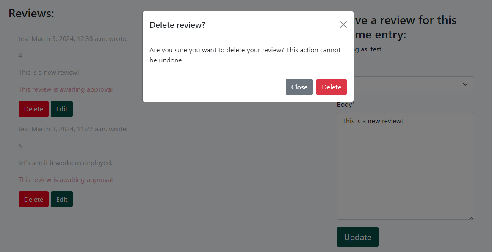

# Django Anime Blog

This project is a Django-based web application for anime enthusiasts to share their thoughts and experiences based on the Blogs and Anime entries I add.

[Anilink Live Project Link](https://django-anime-blog-220e5f361309.herokuapp.com/)

## Features

### Content Management:
- Admin/Owner can post blog entries and reviews for anime they've seen. This can be done from the Django Admin interface.

- Registered users can leave comments on blog posts and reviews.

### User Management:
- User registration, login, and logout functionality.

### Interactions:
- Users can edit and delete their own comments and reviews.

- Confirmation modal appears before deletion for safety and good UX.

 

- Confirmation of deletion message appears after the deletion has been confirmed.

### Informational Pages:
- Dedicated "About Me" page for the blog owner.

### Design:
- The color scheme is inspired by a specific anime image featuring a group of heroes.
- Coolors website was used - [Coolors](https://coolors.co/f2c71e-ed071f-3638b4-35356f-34312a-075146-35ac9a)

## Technologies Used

- **Backend:** Python, Django Framework
- **Frontend:** HTML, CSS, Javascript
- **Testing:** 
  - Lighthouse ![Insert Lighthouse Screenshot Here]

  - Pep8 - Too many files to upload but all the ones I edited came out with this:

    
    Next time I will be using code to automate pep8 validation.

  - JSHint:

     
     
     
    

  - W3C Validator CSS:

    

  - W3C Validator HTML:

     
     
     
     
    

## Testing

The application has undergone a rigorous testing process:

- **Automated Testing:** Unit tests were written to ensure core functionalities work as expected.
  - Try logging in with invalid credentials.
  - Test for collaboration form and comment submission successfully.
  - Test for invalid form content.
- **Manual Testing:** Extensive manual testing involved clicking through all functionalities, verifying form submissions, and confirming page loads.
- **Additional Manual Testing:**
  - Test if registration email is sent successfully.
  - Try logging in with invalid credentials.
  - Verify Edit/Delete functionality for blog post comments and anime reviews.
  - Test image uploads for blog posts and anime entries.
  - Check if pagination works correctly on listings.

## Deployment

This project can be deployed on various cloud platforms. Here are generic instructions for deploying on Heroku:

1. **Heroku Setup:** Create a Heroku account and install the Heroku CLI following their instructions [Heroku Documentation Link](https://devcenter.heroku.com/).
2. **Git Integration:** Initialize a Git repository in your project directory and push your code to Heroku. Refer to the Heroku documentation for details [Heroku Git Deployment Guide](https://devcenter.heroku.com/articles/deploying-python).
3. **Requirements:** Create a `requirements.txt` file listing all your project dependencies. Heroku will install them automatically during deployment.
4. **Configuration:** Set environment variables for any sensitive information like database credentials. Heroku provides ways to manage these securely.
5. **Procfile:** Create a `Procfile` file specifying the command to run your Django application. A simple example: `web: gunicorn myproject.wsgi:application --log-file -`.
6. **Deploy:** Once everything is set up, run `heroku deploy` to deploy your application to Heroku or log in to your Heroku Dashboard and manually Deploy Branch from the Deploy tab.

**Note:** These are general guidelines. Refer to Heroku's documentation for the latest and most accurate instructions.

## Credits

- Major Code credits to the Django Blog Walkthrough - [I think therefore I blog](https://learn.codeinstitute.net/courses/course-v1:CodeInstitute+FSD101_WTS+2023_Q3/courseware/31f4d0db719b4ae38601295fa2151b5c/376093d8bf5a4b2abd2e47bdf47b82bf/) project with a few new custom elements, additions and functionalities.
- Icon set used from [fontawesome](https://fontawesome.com/icons)
- Inspiration for color scheme: [Anime Image Source Link](https://static.wikia.nocookie.net/58fcc31c-3722-4c09-8a0b-2a3662e2c58a/scale-to-width-down/800)
- The rest of the images were all from Wikipedia.

## Future Development Plans

- **Social Media Login:** Integrate with social media platforms like Facebook, Twitter, or Google for user registration and login (as mentioned). This can streamline the registration process and potentially attract a wider user base.
- **Advanced Search:** Implement a more advanced search functionality that allows users to filter blog posts and anime entries by genre, release date, or other relevant criteria.
- **User Recommendations:** Develop a recommendation system that suggests anime or blog posts to users based on their past viewing habits and comments. This can enhance user engagement and discovery of new content.
- **Community Features:** Consider adding features like forums or chat rooms to foster a stronger sense of community among users. This can allow them to discuss anime, share recommendations, and interact directly.
- **Mobile App:** Develop a mobile application for the blog, allowing users to access content and interact on the go. This can significantly increase accessibility and user engagement.
